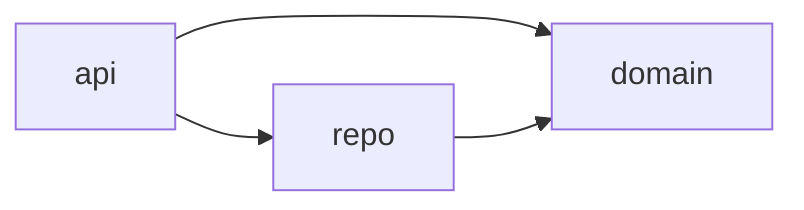
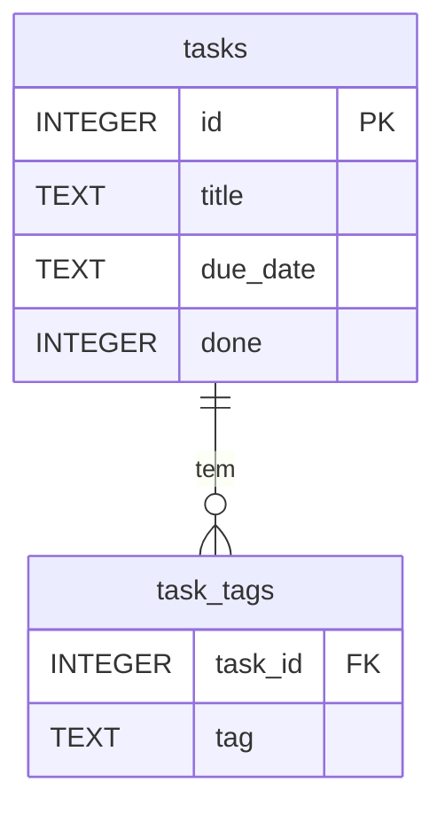
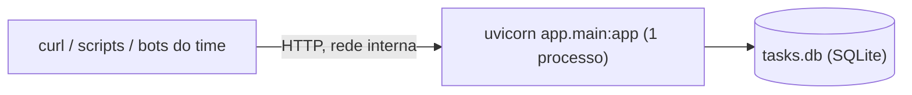

# Architecture Spine — API de Tarefas

## Design Paradigm

Arquitetura em **camadas**, com três módulos dentro de `app/`:

- **`api`**: rotas HTTP, schemas Pydantic e handlers de erro. Não contém regra de negócio.
- **`domain`**: regras puras, sem IO: o relógio, as janelas de prazo e a normalização de tags.
- **`repo`**: o `sqlite3` da stdlib, ou seja, conexão, esquema, CRUD e filtros. Também não contém regra de negócio: recebe limites e tags já calculados pelo `domain`.



Nenhuma outra dependência entre camadas é permitida. Em especial, `domain` não importa `api` nem `repo`.

## Invariants & Rules

### AD-1 — Stack Python + FastAPI + sqlite3 [ADOPTED]

- **Binds:** all
- **Prevents:** stories que adotam bibliotecas concorrentes (ORM, outro framework, outro banco).
- **Rule:** Python 3.14, FastAPI e o `sqlite3` da stdlib, em um projeto `uv`. As dependências de runtime são só `fastapi`, `uvicorn` e `tzdata`. As de desenvolvimento são só `pytest`, `httpx` e `ruff`. Não há ORM e não se usa `fastapi[standard]`, que traz telemetria e CLI de nuvem. Uma dependência nova precisa de um AD.

### AD-2 — Um único relógio: instante em UTC, data em `America/Sao_Paulo`

- **Binds:** FR-1, FR-7, FR-8, NFR-2
- **Prevents:** "hoje" calculado no fuso do servidor (UTC) em um ponto e no de São Paulo em outro, e testes que pulam a conversão de fuso.
- **Rule:** o instante atual só é lido em `domain.now()`, que devolve um `datetime` em UTC com fuso. A data de hoje só sai de `domain.today(now)`, que converte esse instante com `ZoneInfo("America/Sao_Paulo")`. É proibido chamar `date.today()`, `datetime.now()` ou similares fora de `domain.now()`. A camada `api` recebe `now` como dependência do FastAPI e os testes substituem **só o `now`**, com um instante UTC fixo. Assim, a conversão de fuso sempre roda.

### AD-3 — Janelas de prazo definidas em um só lugar, com limites inclusivos

- **Binds:** FR-7, FR-8, NFR-2
- **Prevents:** duas definições de "próximos 7 dias", ou limites semiabertos de um lado e `BETWEEN` do outro.
- **Rule:** `domain.window_bounds(janela, hoje)` devolve `(início, fim)`, os dois **inclusivos**, como texto `YYYY-MM-DD` ou `None`:

| Janela | Início | Fim |
| --- | --- | --- |
| `overdue` | `None` | hoje − 1 |
| `today` | hoje | hoje |
| `next7` | hoje + 1 | hoje + 7 |

  O `repo` aplica `due_date >= início` e `due_date <= fim`, omitindo o lado que for `None`, e sempre `done = 0`. Nenhuma outra camada calcula datas de janela.

### AD-4 — Validação de campos com tipos compartilhados

- **Binds:** FR-1, FR-3, FR-7
- **Prevents:** `POST` e `PATCH` validando o mesmo campo de jeitos diferentes, e prazos fora do formato que quebram a ordenação (AD-5).
- **Rule:** um tipo único por campo, definido uma vez e usado em todos os schemas:
  - **`DueDate`:** só aceita texto no formato `^\d{4}-\d{2}-\d{2}$` que também seja uma data válida no calendário. Timestamp, data com hora e `2026-02-30` dão 422.
  - **`Title`:** texto que passa por `strip()` e não pode ficar vazio.
  - **`done`:** booleano JSON estrito.
  - **`due`:** o parâmetro de janela é um enum `overdue | today | next7`.

  Os schemas de entrada usam `extra="forbid"`. O `POST` não aceita `done`, porque a tarefa nasce não concluída. No `PATCH`, campo omitido não muda; `null` em qualquer campo, incluindo `tags`, dá 422; `tags: []` limpa as tags.

### AD-5 — Modelo de dados

- **Binds:** FR-1 a FR-6, NFR-4
- **Prevents:** tags guardadas como JSON em uma story e como tabela em outra; datas em formato que não ordena; esquema dividido entre stories.
- **Rule:** o esquema completo é este, e é criado inteiro na story 1.1:

```sql
CREATE TABLE IF NOT EXISTS tasks (
  id       INTEGER PRIMARY KEY,
  title    TEXT    NOT NULL,
  due_date TEXT    NOT NULL,          -- YYYY-MM-DD
  done     INTEGER NOT NULL DEFAULT 0 -- 0 ou 1
);
CREATE TABLE IF NOT EXISTS task_tags (
  task_id INTEGER NOT NULL REFERENCES tasks(id) ON DELETE CASCADE,
  tag     TEXT    NOT NULL,           -- já normalizada (AD-9)
  PRIMARY KEY (task_id, tag)
);
```

### AD-6 — Contrato HTTP [ADOPTED] em parte

- **Binds:** FR-1 a FR-8
- **Prevents:** verbos, status e nomes de campo inventados por story.
- **Rule:**

| Operação | Rota | Sucesso | Erros |
| --- | --- | --- | --- |
| Criar (FR-1, FR-5) | `POST /tasks` | 201 + tarefa | 422 |
| Listar e filtrar (FR-2, FR-6 a FR-8) | `GET /tasks?tag=&due=` | 200 + lista | 422 |
| Consultar (FR-2) | `GET /tasks/{id}` | 200 + tarefa | 404 |
| Editar e concluir (FR-3, FR-5) | `PATCH /tasks/{id}` | 200 + tarefa | 404, 422 |
| Excluir (FR-4) | `DELETE /tasks/{id}` | 204, sem corpo | 404 |

  A tarefa sempre tem a forma `{"id": int, "title": str, "due_date": "YYYY-MM-DD", "tags": [str], "done": bool}`, e `tags` aparece desde a story 1.1, mesmo que vazia. `?tag=` e `?due=` aceitam um valor cada e podem ser combinados (interseção). Toda lista vem ordenada por `due_date` crescente e, em empate, por `id` crescente. Do PRD foram adotados: `POST /tasks` com 201 e 422, os campos `title` e `due_date`, e a ausência de paginação.

### AD-7 — Envelope de erro único, com códigos fechados

- **Binds:** NFR-3, todos os FRs com caminho de erro
- **Prevents:** o 422 padrão do FastAPI (`{"detail": [...]}`) em uma rota e um formato próprio em outra, ou `field` derivado de jeitos diferentes.
- **Rule:** todo erro sai como `{"error": {"code", "field", "message"}}`. Há três handlers globais em `main.py`: `RequestValidationError`, o `HTTPException` **do Starlette** (para pegar também a rota inexistente e o 405) e `Exception`. Os códigos são só estes:

| Status | `code` | `field` |
| --- | --- | --- |
| 422 | `validation_error` | o `loc` do **primeiro** erro, sem o primeiro elemento (`body`/`query`/`path`), unido por `.` (por exemplo, `title`, `tags.0`, `due`) |
| 404 (tarefa) | `not_found` | `"id"` |
| 404 (rota) | `not_found` | `null` |
| 405 | `method_not_allowed` | `null` |
| 500 | `internal_error` | `null` |

  Toda regra que gera um 422, inclusive a de tag vazia, fica em validadores Pydantic, nunca em `if` dentro da rota. O `message` é montado pelo handler, em português, a partir de `code` e `field`. Os testes conferem `code` e `field`, nunca o texto de `message`.

### AD-8 — Testes contra o app real, com banco descartável

- **Binds:** NFR-2, SM-1
- **Prevents:** testes que dependem do relógio real, de um banco compartilhado ou de fixtures redefinidas em cada story.
- **Rule:** pytest + `TestClient`. O `tests/conftest.py`, criado na story 1.1, é o único lugar que define estas fixtures:
  - **`client`:** aponta `TASKS_DB_PATH` para um arquivo em `tmp_path`, usando `monkeypatch`, e devolve `TestClient(app)`.
  - **`set_now(instante_utc)`:** substitui `domain.now` por meio de `app.dependency_overrides`.

  Os testes das janelas cobrem ontem, hoje, amanhã, hoje + 7, hoje + 8 e uma tarefa concluída. Cobrem também o instante `2026-10-03T01:00Z`, em que a data em UTC já é o dia 3 e a de São Paulo ainda é o dia 2.

### AD-9 — Tags: normalização, leitura e escrita com um dono só

- **Binds:** FR-5, FR-6, FR-8
- **Prevents:** tag gravada como `Backend` e filtro buscando `backend`; `["Backend","backend"]` virando 500 por chave duplicada; filtro com `JOIN` que devolve só a tag buscada; tags em ordem diferente em cada rota.
- **Rule:**
  - **Normalização:** `domain.normalize_tags(lista)` aplica `strip()` + `casefold()`, rejeita tag vazia (o validador dá 422), remove repetidas e ordena em ordem alfabética. Toda tag de entrada passa por ela, inclusive o `?tag=`.
  - **Escrita e leitura:** no `repo`, `replace_tags(conn, task_id, tags)` é o único caminho de escrita e `load_tags` é o único de leitura; toda resposta traz todas as tags da tarefa, em ordem alfabética.
  - **Filtro:** o filtro por tag usa `EXISTS (SELECT 1 FROM task_tags ...)`, nunca `JOIN` na consulta principal.

### AD-10 — Conexão, esquema e transação

- **Binds:** NFR-4, todas as stories que tocam o banco
- **Prevents:** conexão global entre threads (`check_same_thread`), esquema que só nasce no `lifespan` e não roda nos testes, `TASKS_DB_PATH` lido uma vez na importação, `PATCH` aplicado pela metade.
- **Rule:** `repo.connect()` é o único lugar que abre conexão. Ele:
  - lê `TASKS_DB_PATH` **a cada chamada**;
  - ativa `PRAGMA foreign_keys = ON`;
  - garante o esquema do AD-5.

  A `api` recebe uma conexão por requisição, por meio de uma dependência `get_db()` com `yield` que a fecha no fim. As rotas são `def`, não `async def`. Toda escrita que toca mais de uma linha, como uma tarefa e suas tags, roda dentro de `with conn:`, em uma única transação.

## Consistency Conventions

| Concern | Convention |
| --- | --- |
| Naming | Rotas, campos JSON e colunas em inglês, `snake_case`. Código em inglês. Documentação, `message` de erro e commits em português. |
| Ids | Inteiro gerado pelo SQLite (`INTEGER PRIMARY KEY`). |
| Datas | `YYYY-MM-DD` na API e no banco (AD-4). Nenhum timestamp na v1. |
| Configuração | Só por variável de ambiente: `TASKS_DB_PATH`, com padrão `./tasks.db`. O fuso não é configurável (AD-2). |
| Esquema | Sem ferramenta de migração na v1 (AD-5, AD-10). |
| Documentação (NFR-1) | `README.md` com exemplos `curl` de criar uma tarefa com tag e prazo e de listar as vencidas. O `/docs` automático do FastAPI complementa, mas não substitui. |
| Qualidade | `ruff check` e `ruff format`. `uv run pytest` precisa passar antes de cada commit de story. |

## Stack

Versões conferidas no PyPI e no python.org em 2026-10-02.

| Name | Version |
| --- | --- |
| Python | 3.14 (`requires-python >= 3.14`) |
| uv | 0.12.22 |
| FastAPI | 0.142.2 |
| Pydantic | 2.13.x (via FastAPI) |
| uvicorn | 0.54.0 |
| tzdata | 2026.4 |
| SQLite | `sqlite3` da stdlib |
| pytest | 9.1.1 (dev) |
| httpx | 0.28.1 (dev, para o `TestClient`) |
| Ruff | 0.16.10 (dev) |

## Structural Seed





```text
api-tarefas/
  pyproject.toml     # uv: dependências e config do ruff/pytest
  README.md          # exemplos curl (NFR-1)
  app/
    main.py          # cria o app e registra os handlers de erro (AD-7)
    api.py           # rotas, schemas e tipos compartilhados (AD-4, AD-6)
    domain.py        # now(), today(), window_bounds(), normalize_tags()
    repo.py          # connect(), esquema, CRUD, filtros, tags (AD-5, AD-9, AD-10)
  tests/
    conftest.py      # fixtures client e set_now (AD-8)
    test_tasks.py
    test_filters.py
```

**Deploy:** um único processo, `uvicorn app.main:app --host <IP interno>`, em uma máquina da rede interna do time-piloto, com o banco em arquivo local. O `--host` é o IP da rede interna, nunca `0.0.0.0` em uma máquina exposta (NFR-5). Não há Docker nem CI na v1.

## Capability → Architecture Map

| Capability / Area | Lives in | Governed by |
| --- | --- | --- |
| FR-1 a FR-4 (CRUD e conclusão) | `api`, `repo` | AD-4, AD-5, AD-6, AD-7, AD-10 |
| FR-5, FR-6 (tags) | `domain.normalize_tags`, `repo` | AD-9 |
| FR-7, FR-8 (janelas e combinação) | `domain` (limites), `repo` (SQL) | AD-2, AD-3, AD-9 |
| NFR-1 (docs) | `README.md` | Convenções |
| NFR-2 (testes) | `tests/` | AD-8 |
| NFR-3 (erros) | `main.py` (handlers) | AD-7 |
| NFR-4 (persistência) | `repo`, `tasks.db` | AD-5, AD-10 |
| NFR-5 (rede interna) | deploy | Structural Seed |

## Deferred

- **Migração de esquema:** fica sem ferramenta enquanto houver só duas tabelas. Adotar uma quando surgir a primeira mudança de esquema com dados reais.
- **Docker, CI e backup do `tasks.db`:** dependem de onde o time-piloto vai hospedar a API.
- **Logs e observabilidade:** a v1 usa só o log padrão do uvicorn.
- **Autenticação, vários times e fuso por requisição (`X-Timezone`):** ficam para a visão do PRD.
- **Paginação:** está no backlog do PRD.
- **Concorrência:** um processo com SQLite basta para um time pequeno. Rever se houver mais de um worker.
- **Python 3.15:** reavaliar o `requires-python` quando sair a versão estável.
