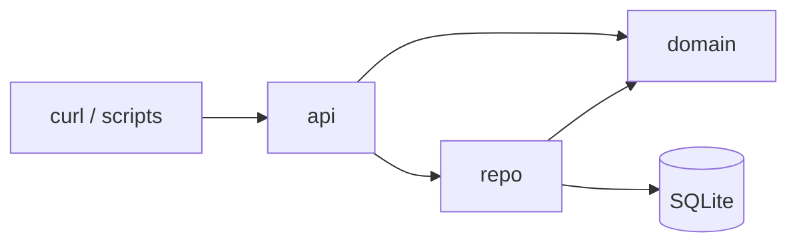
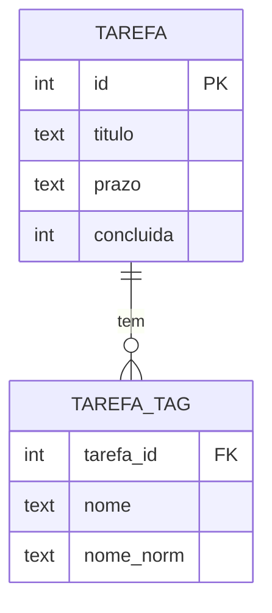

# Architecture Spine — api-tarefas

## Design Paradigm

Arquitetura em camadas, com uma camada por módulo em `src/tarefas/`:

- **`api.py`**: HTTP. Rotas FastAPI, schemas Pydantic, dependências (`agora`, conexão) e o objeto `app`.
- **`domain.py`**: regras puras. Tipos do domínio, cálculo de hoje, intervalo de cada janela e normalização de tags. Não importa FastAPI, Pydantic nem sqlite3.
- **`repo.py`**: persistência. SQL sobre `sqlite3` da stdlib, sem ORM.



As setas indicam quem pode importar quem. `domain` não importa ninguém. `repo` nunca importa `api`.

## Invariants & Rules

### AD-1 — Camadas e direção de dependência [ADOPTED]

- **Binds:** all
- **Prevents:** regra de negócio em rota ou em SQL; domínio acoplado a framework.
- **Rule:** respeitar o diagrama acima. Regra de prazo, janela ou tag mora só em `domain.py`. Um módulo novo entra numa das três camadas e herda as regras dela.

### AD-2 — Relógio injetado como instante [ADOPTED]

- **Binds:** FR-1, FR-6, NFR-1, NFR-3
- **Prevents:** chamar `date.today()`/`datetime.now()` fora do ponto de injeção; testes que fixam a data e não exercitam o fuso.
- **Rule:** `api.agora() -> datetime` (UTC aware) é a **única** leitura do relógio, e as rotas a recebem via `Depends`. `domain.hoje(agora) -> date` converte para `ZoneInfo("America/Sao_Paulo")` e pega `.date()`. Os testes substituem `agora` com `app.dependency_overrides`. O caso das 22h em SP é testado com o instante `01:00 UTC` do dia seguinte.

### AD-3 — Janela vira intervalo só no domain

- **Binds:** FR-6, SM-1
- **Prevents:** regra de janela duplicada em Python e SQL, com limites que divergem.
- **Rule:** `domain.Janela` é um `StrEnum` com os valores `vencidas`, `hoje` e `proximos-7-dias`. `domain.intervalo(janela, hoje) -> (de, ate)` devolve os limites inclusivos, que podem ser `None` (vencidas: `(None, hoje-1)`, hoje: `(hoje, hoje)`, próximos 7 dias: `(hoje+1, hoje+7)`). O repo só aplica `prazo >= de`/`prazo <= ate` e `concluida = 0` quando há janela. Ele não conhece os nomes das janelas.

### AD-4 — Ordenação determinística

- **Binds:** FR-4, FR-6
- **Prevents:** ordens diferentes entre listagem e janelas; testes instáveis com prazos iguais.
- **Rule:** toda listagem usa `ORDER BY prazo ASC, id ASC`. `id` é `INTEGER PRIMARY KEY AUTOINCREMENT`.

### AD-5 — Normalização de tag é uma função só

- **Binds:** FR-1, FR-2, FR-5, FR-6
- **Prevents:** escrita e filtro normalizando de jeitos diferentes, por exemplo `lower()` num lugar e `casefold()` no outro, ou trim só num dos lados.
- **Rule:**
  - **Funções do domain:** `domain.norm_tag(s) -> str` = `s.strip().casefold()`. `domain.normalizar_tags(lista) -> list[str]` aplica `strip`, levanta `ValueError` para tag vazia e remove duplicadas por `norm_tag`, mantendo a grafia e a posição da primeira ocorrência.
  - **api:** o schema chama `normalizar_tags` num validator, e o Pydantic converte o `ValueError` em 422.
  - **repo:** aplica `norm_tag` ao gravar `nome_norm` e ao filtrar (`nome_norm = norm_tag(tag)`). Nenhuma outra camada faz `casefold`/`lower`.
  - **Ordem:** as tags voltam na ordem de inserção (`ORDER BY rowid`).

### AD-6 — Validação na borda, estrita

- **Binds:** FR-1, FR-2, FR-5, FR-6
- **Prevents:** valores aceitos em silêncio que o PRD manda rejeitar.
- **Rule:** os schemas Pydantic da api usam `extra="forbid"`.

  | Campo | Regra |
  |---|---|
  | `titulo` | `strip`, 1 a 200 caracteres |
  | `prazo` | `Annotated[date, BeforeValidator(...)]`: exige `str` casando `^\d{4}-\d{2}-\d{2}$` e depois o parse normal de `date`. Não usar `Strict()`: no corpo do FastAPI ele rejeita até `"2026-10-06"`. Sem o regex, `2026-10-06T00:00:00` passaria |
  | `tags` | lista de tags com no máximo 50 caracteres cada, depois do strip |
  | `concluida` | `StrictBool` |

  - **POST:** não aceita `concluida`, que dá 422 por `extra="forbid"` (a tarefa nasce pendente).
  - **PATCH:** todo campo é opcional, um campo omitido mantém o valor e `null` é 422. `{}` devolve 200 com a tarefa inalterada. `tags: []` limpa a lista.
  - **Query:** `tag` é declarado como `list[str]`. Mais de um valor, valor vazio depois do strip ou valor acima de 50 caracteres dá 422, com a checagem feita na rota. `janela` é um `Janela`, e valor desconhecido é 422.
  - **Precedência:** a validação (422) vem antes da busca do `id` (404).

### AD-7 — Contrato HTTP

- **Binds:** FR-1 a FR-6, NFR-2
- **Prevents:** códigos e rotas inventados por quem implementa cada story.
- **Rule:**

  | Operação | Rota | Sucesso |
  |---|---|---|
  | Criar | `POST /tarefas` | 201 + tarefa |
  | Listar / janela | `GET /tarefas?janela=&tag=` | 200 + lista |
  | Editar | `PATCH /tarefas/{id}` | 200 + tarefa |
  | Excluir | `DELETE /tarefas/{id}` | 204 sem corpo |

  `id` inexistente dá 404 via `HTTPException`. Erros usam o formato padrão do FastAPI, `{"detail": ...}`. Sem autenticação (NFR-2).

### AD-8 — Persistência e conexão

- **Binds:** NFR-5, todas as operações de escrita
- **Prevents:** `ProgrammingError` de thread no sqlite3; escrita parcial de tarefa sem tags; dois donos do schema.
- **Rule:**
  - **Conexão:** uma conexão por request, aberta na dependência `api.conexao` com `yield`, com `check_same_thread=False` e `PRAGMA foreign_keys=ON`. Endpoints `def` são síncronos.
  - **Banco e schema:** o arquivo vem de `TAREFAS_DB` (padrão `tarefas.db`), lido a cada abertura de conexão e nunca na importação, para os testes poderem trocá-lo com `monkeypatch.setenv`. O schema é criado só por `repo.criar_schema(conn)` com `CREATE TABLE IF NOT EXISTS` e não há migrações. Quem chama é a própria dependência de conexão, e não o lifespan, porque `TestClient` usado fora de `with` não roda o lifespan.
  - **Transações:** cada função de escrita do repo roda numa transação (`with conn:`). No PATCH com tags, as tags são apagadas e reinseridas na mesma transação da tarefa.

### AD-9 — Formato único entre camadas e assinaturas do repo

- **Binds:** FR-1 a FR-6, todas as stories
- **Prevents:** `sqlite3.Row`/dict vazando para a api (`concluida: 1`, tarefa sem tags); várias funções de listagem que confundem "sem janela" com "vencidas"; PATCH com semânticas diferentes para campo omitido; 404 virando 500.
- **Rule:** `domain.Tarefa` (dataclass: `id: int, titulo: str, prazo: date, tags: list[str], concluida: bool`) é o único tipo que o repo devolve e a api serializa. As conversões 0/1 e ISO ficam dentro do repo. O repo expõe só estas funções, todas com `conn` como primeiro argumento:

  | Função | Retorno |
  |---|---|
  | `criar(conn, titulo, prazo, tags)` | `Tarefa` |
  | `listar(conn, *, pendentes=False, de=None, ate=None, tag=None)` | `list[Tarefa]` |
  | `editar(conn, id, campos: dict)` | `Tarefa \| None` |
  | `excluir(conn, id)` | `bool` |

  - **`listar`:** é a única função de listagem. A api passa `pendentes=True` se e só se houver janela.
  - **`editar`:** `campos` vem de `model_dump(exclude_unset=True)`. Chave ausente mantém o valor.
  - **Inexistente:** `None`/`False` significa id inexistente, e a rota levanta 404. O SQL de `tarefa_tag` existe só dentro do `repo`.

## Consistency Conventions

| Concern | Convention |
| --- | --- |
| Nomes | Em português, alinhados ao glossário do PRD, sem acento em identificadores: `Tarefa`, `titulo`, `prazo`, `tags`, `concluida`, `janela`, `hoje`. |
| JSON da tarefa | `{"id": int, "titulo": str, "prazo": "YYYY-MM-DD", "tags": [str], "concluida": bool}`. Listagens devolvem um array JSON, sem envelope. |
| Armazenamento | `prazo` é TEXT em ISO, para comparar e ordenar como texto. `concluida` é INTEGER 0/1. |
| Testes | pytest + `fastapi.testclient` (httpx). Um único `tests/conftest.py` com a fixture `client`, que **sempre** substitui `api.agora` por um instante fixo (ajustável pelo teste) e aponta `TAREFAS_DB` para `tmp_path`. Um teste para cada caso-limite do FR-6 (NFR-3). |
| Estilo | `ruff check` + `ruff format`, sem config extra além de `target-version = "py314"`. |
| Documentação | README com exemplos de `curl` que cobrem o SM-2, além do `/docs` automático. |

## Stack

| Name | Version |
| --- | --- |
| Python | 3.14 |
| uv | 0.12 |
| FastAPI (sem `[standard]`) | 0.142.2 |
| Pydantic | 2.13.5 (via FastAPI) |
| uvicorn | 0.54.0 |
| tzdata (runtime) | 2026.5 |
| sqlite3 | stdlib |
| pytest (dev) | 9.1.1 |
| httpx (dev) | 0.28.1 |
| ruff (dev) | 0.16.10 |

## Structural Seed

```text
api-tarefas/
  pyproject.toml        # uv init --package; deps: fastapi, uvicorn, tzdata; dev: pytest, httpx, ruff
  README.md             # exemplos curl (NFR-4)
  src/tarefas/
    api.py              # app, rotas, schemas, dependências agora() e conexão
    domain.py           # Janela, hoje(), intervalo(), norm_tag(), normalizar_tags()
    repo.py             # criar_schema() e CRUD em SQL
  tests/
    conftest.py         # fixture client (relógio fixo + banco em tmp_path)
    test_tarefas.py     # CRUD, validações, tags
    test_janelas.py     # casos-limite do FR-6 e do fuso
```



`TAREFA_TAG` tem `UNIQUE(tarefa_id, nome_norm)` e `ON DELETE CASCADE`.

**Execução:** `TAREFAS_DB=/caminho/absoluto/tarefas.db uv run uvicorn tarefas.api:app --host 0.0.0.0 --port 8000`, numa máquina da rede interna do time (NFR-2). O caminho absoluto evita que, ao subir de outro diretório, a API abra um banco novo e vazio.

## Capability → Architecture Map

| Capability / Area | Lives in | Governed by |
| --- | --- | --- |
| FR-1 Criar | `api` → `repo` | AD-5, AD-6, AD-7, AD-8, AD-9 |
| FR-2 Editar | `api` → `repo` | AD-5, AD-6, AD-7, AD-8, AD-9 |
| FR-3 Excluir | `api` → `repo` | AD-7, AD-8 (cascade), AD-9 |
| FR-4 Listagem geral | `api` → `repo` | AD-4, AD-7, AD-9 |
| FR-5 Tags e filtro | `domain`, `repo` | AD-5, AD-6, AD-9 |
| FR-6 Janelas | `domain` (+ `api.agora`) | AD-2, AD-3, AD-4, AD-6, AD-9 |
| NFR-1 Fuso | `domain.hoje`, `tzdata` | AD-2 |
| NFR-2 Rede interna | execução (Structural Seed) | AD-7 |
| NFR-3 Testes | `tests/test_janelas.py` | AD-2, convenção Testes |
| NFR-4 Docs | `README.md` | convenção Documentação |
| NFR-5 Persistência | `repo` | AD-8 |

## Deferred

- **Docker, CI e deploy automatizado:** a v1 roda com `uv run` numa máquina interna. Revisitar quando houver um segundo ambiente.
- **Migrações de schema:** o schema da v1 é fixo. Adotar uma ferramenta na primeira mudança de schema com dados reais.
- **Paginação, filtro por várias tags, `GET /tarefas/{id}`:** fora do PRD.
- **Autenticação e multi-time:** visão futura do PRD (§1). Quando entrar, ocupa a camada `api`.
- **Logging e observabilidade:** fica o padrão do uvicorn. Revisitar se a API sair do piloto.
- **Backup do banco e supervisão do processo:** fica manual na v1. Revisitar se o piloto passar a depender da API no dia a dia.
- **`httpx` → `httpx2` no TestClient:** o Starlette 1.7.0 avisa que o `httpx` está depreciado ali. Mantido `httpx` por escolha do usuário. Trocar se o aviso virar erro.
- **Concorrência de escrita:** é o lock de arquivo do SQLite, suficiente para um time pequeno. Revisitar se aparecer `database is locked`.
